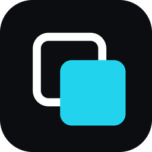

# OverHud

<p align="center">
  
</p>

<p align="center">
  <a href="https://github.com/PatricioCisterna/overhud/releases/latest/download/OverHud-setup.exe"><b>⬇ Descargar OverHud para Windows</b></a>
  ·
  <a href="https://github.com/PatricioCisterna/overhud/releases">Todas las versiones</a>
</p>

Overlay de voz para Discord: muestra quién está en tu canal y quién habla, encima del juego o de lo que tengas abierto. Es una versión modificada de [Overlayed](https://github.com/overlayeddev/overlayed), con más opciones.

### Qué trae de nuevo

- **Panel de sonidos**: tres puntos debajo del último participante abren un panel al estilo de Discord, con buscador, sonidos por servidor y recientes. Funciona aunque el overlay esté fijado.
- **Español e inglés**: se elige en *Ajustes → Configuración*. La primera vez sigue el idioma de Windows.
- **Recuerda el fijado**: si lo cerrás fijado, vuelve a abrir fijado y en el mismo lugar.
- **Abrir al iniciar Windows**: interruptor en la configuración.
- **Mostrar u ocultar nombres**: sin nombres solo quedan los avatares, con el icono de silenciado encima.
- **Avatares animados**: los GIF de perfil se mueven mientras esa persona habla, como en Discord. Se puede apagar.
- **Instalador liviano**: unos 5 MB, no pide permisos de administrador.

### Instalación (Windows)

1. Descargá el instalador desde el enlace de arriba y abrilo.
2. Windows puede mostrar *"Windows protegió su PC"* porque el instalador no está firmado. Pulsá **Más información → Ejecutar de todas formas**.
3. Al abrir OverHud, Discord te pide autorizar la app. Entre los permisos aparece uno para controlar la voz: es el que usa el panel de sonidos para reproducirlos en tu canal.

> Si Windows lo bloquea sin dar opción, tenés activado el *Control inteligente de aplicaciones*, que solo deja abrir programas firmados.

### Compilarlo vos mismo

Necesitás Node 20, pnpm 9, Rust y las herramientas de C++ de Visual Studio.

```
pnpm install
cd apps/desktop
pnpm run build:desktop:unsigned
```

El instalador queda en `apps/desktop/src-tauri/target/release/bundle/nsis/`.

### Créditos y licencia

OverHud está basado en [Overlayed](https://github.com/overlayeddev/overlayed), del equipo de Overlayed, y se distribuye bajo la misma licencia, [AGPL-3.0](./LICENSE). No está afiliado a Overlayed ni a Discord. Discord es una marca de Discord Inc.
